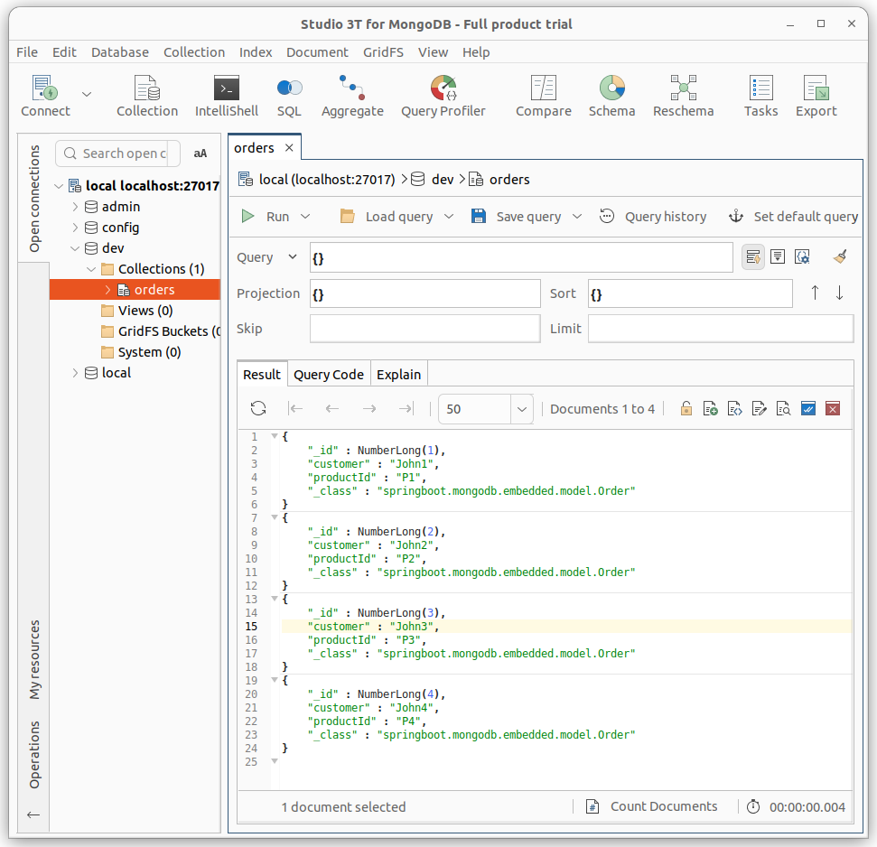

Spring Boot MongoDB embedded 
--

### Description<br/>
This project is an example of using Spring Boot with MongoDB but more particular testing is done using an embedded MongoDB instance instead of docker. <br/>
It includes a simple data model and repository.<br/>
The embedded MongoDB instance is running on localhost:27017
### Usage
Requires JDK 17<br/>
To run the tests use the following gradle task:<br/>
```
./gradlew clean test
```
> [!TIP]
> This embedded-MongoDB test ran on Ubuntu 22.04.4 which support MonogoDB 6.x and up. This is because of libcrypto.so was updated to version 3.x on Ubuntu 22.<br/>
> If you require to run MonogoDB 4.x tests you need to run on an older Ubuntu version that has libcrypto.so.1.1 like Ubuntu 18.

### Screenshot
This was generated by putting a Thread.sleep() in the middle of the test and using Studio3T as a client to explore the embedded MongoDB instance.

